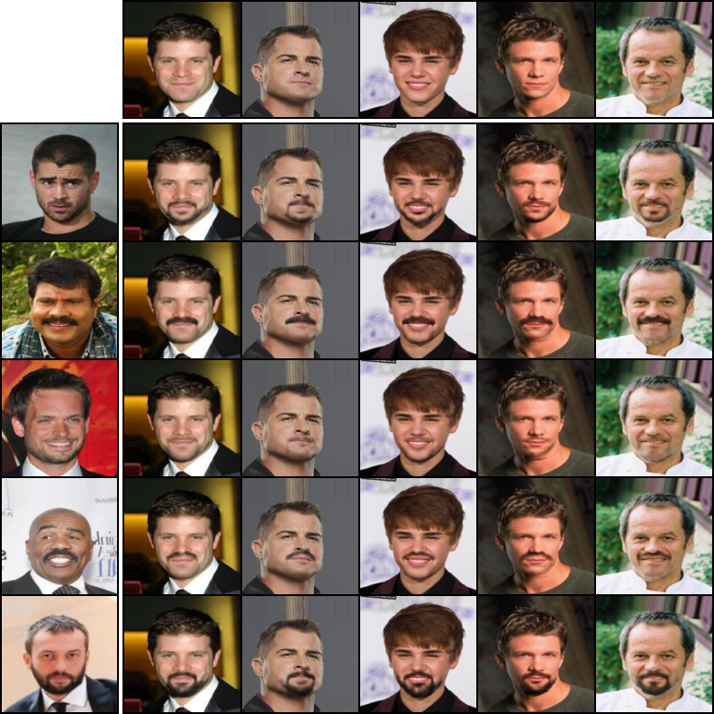

# Mask Based Unsupervised Content Transfer

PyTorch implementation of "Mask Based Unsupervised Content Transfer".

Given two domains where one contains some additional information compared to the other, our method disentangles the common and the seperate parts and transfers the seperate information from one image to another using a mask, while not using any supervision at train time. For example, we can transfer facial hair from an image of a men with a mustache to an image of a shaved person, see image below. Using a mask enables state-of-the-art quality, but also, the generated mask can be used as a semantic segmentation of the seperate part. Thus our method perform weakly-supervised semantic segmentation, using only class lables as supervision, achieving state-of-the-art performance.

For more details, please refer to the [paper](https://arxiv.org/abs/1906.06558).

The first example presents facial hair transfer, where the facial hair of the men in the left column transferred to the shaved men in the upper row. The second example illustrate semantic segmentation of glasses and facial hair:


The second example illustrate semantic segmentation of glasses and facial hair:


## Prerequisites:
Python 2.7 / 3.6, Pytorch 0.4, argparse, Pillow

## Download and Prepare the Data:

Download [celebA](http://mmlab.ie.cuhk.edu.hk/projects/CelebA.html) directly or by running the following command:
```
bash celeba_downloader.sh
```
(or using this [script](https://gist.github.com/charlesreid1/4f3d676b33b95fce83af08e4ec261822))
Contrary to the notation used in the paper, A is the larger set, for example, A is people with glasses and B is people without.
You can use the provided script preprocess.py to split celebA into the above format (with A and B based on the attribute of your choosing).
For example, you can run the script using the following command (for Eyewear):
```
python preprocess.py --root ./img_align_celeba --attributes ./list_attr_celeba.txt --dest ./glasses_data --config glasses
```
## Training
The Hyperparameters names are different then the article, the mapping between the codes name and the loss functions is:
- alpha1 - 
- alpha2 - 
- beta1 -  (first term)
- beta2 -  (second term) 
- delta - 
- gama -  
- discweight - 


Train using mask_train.py. You can use the following example to run with default hyperparameters (for Eyewear):
```
python mask_train.py --root ./glasses_data --out ./glasses_experiment
```
For choosing GPU use
```
--gpu 3
```
You can use the following example to resume training:
```
python mask_train.py --root ./glasses_data --out ./glasses_experiment --load ./glasses_experiment
```
## Evaluation
You can evalute with the command:
```
python mask_eval.py --root ./glasses_data --out ./glasses_experiment
```
Note that for evluate the segmentation, one should perform thresholding on the generated mask (search for the best threshold).

## Hyperparameters:

Hyperparameters for Eyewear (glasses) are the defualt.

- Hyperparameters for smile (male and female):
```
--lr 0.0002 --disclr 0.0002 --alpha1 1.0 --alpha2 1.0 --beta1 0.0 --beta2 0.0001 --gama 7.0 --delta 5.0 --discweight 0.005
```
- Hyperparameters for women hair segmentation ("black to blond content transfer"):
```
--lr 0.0002 --disclr 0.0002 --alpha1 0.1 --alpha2 0.1 --beta1 0.0 --beta2 0.04 --gama 1.0 --delta 1.0 --discweight 1.0
```
- Hyperparameters for men hair segmentation ("dark hair to bald content transfer", use the bald condig in preprocess.py):
```
--lr 0.0002 --disclr 0.0002 --alpha1 0.5 --alpha2 0.5 --beta1 0.0 --beta2 0.5 --gama 5.0 --delta 5.0 --discweight 1.0
```

## Custom Dataset
First, You can then run the preprocessing in the following manner:
```
python preprocess.py --root ./custom_dataset --dest ./custom_train --folders
```
or use the following format for the images:
```
root/
     trainA/
     trainB/
     testA/
     testB/
```
Second, search for the best hyperparameters, as the default hyperparameters might not suit any dataset.

## Acknowledgements
This implementation is heavily based on https://github.com/oripress/ContentDisentanglement.

## Citation
If you found this work useful, please cite.
```
@article{abs-1906.06558,
  author    = {Ron Mokady and
               Sagie Benaim and
               Lior Wolf and
               Amit Bermano},
  title     = {Mask Based Unsupervised Content Transfer},
  journal   = {CoRR},
  volume    = {abs/1906.06558},
  year      = {2018},
  url       = {http://arxiv.org/abs/1906.06558},
  archivePrefix = {arXiv},
  eprint    = {1906.06558},
}
```
